# Terminal-settings Windows


## 1. Descargar "PowerShell" de la Microsoft Store

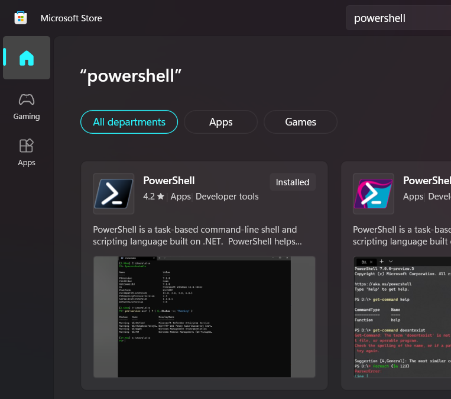


## 2. Establecer "PowerShell" como predeterminado:

### 2.1. Ingresando a Settings
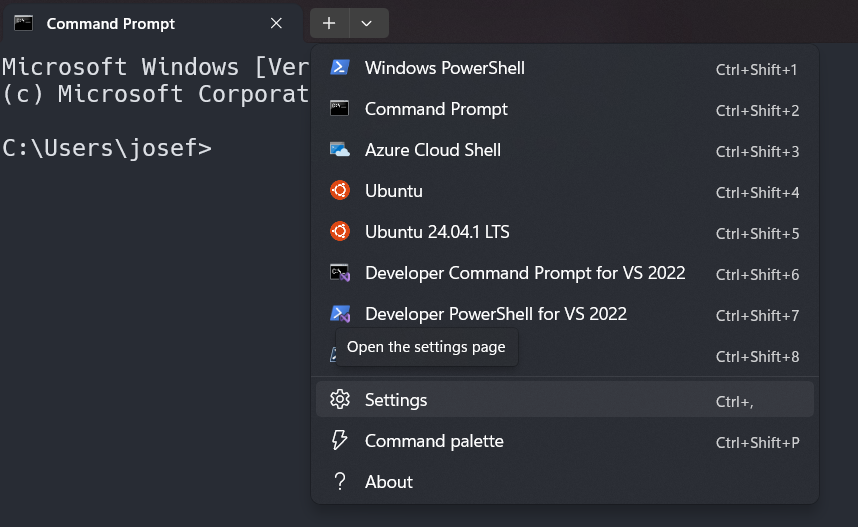


### 2.2. Cambiando terminar por defecto
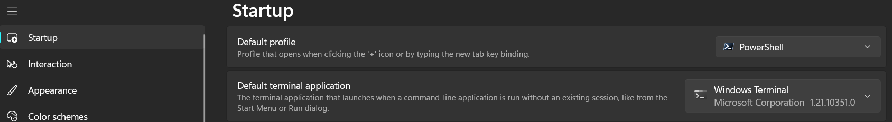

## 3. Instalar "Oh my Posh"

Ingresar al siguiente link:
https://ohmyposh.dev/docs/installation/windows


```powershell
winget install JanDeDobbeleer.OhMyPosh -s winget
```

## 4. Crear un perfil

Ingresar al siguiente link:
https://ohmyposh.dev/docs/installation/prompt

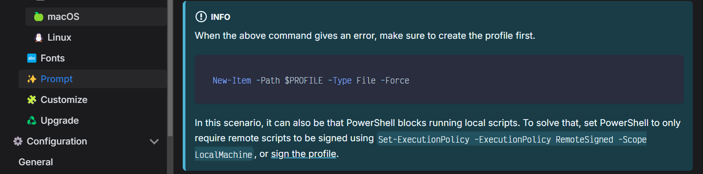

```powershell
New-Item -Path $PROFILE -Type File -Force
```

## 5. Instalar "Hack Nerd Font"

Ingresar al siguiente link:
https://ohmyposh.dev/docs/installation/fonts
Ingresar al siguiente link:
https://www.nerdfonts.com/
Ingresar al siguiente link (ingresar a este link y busca el font):
https://www.nerdfonts.com/font-downloads


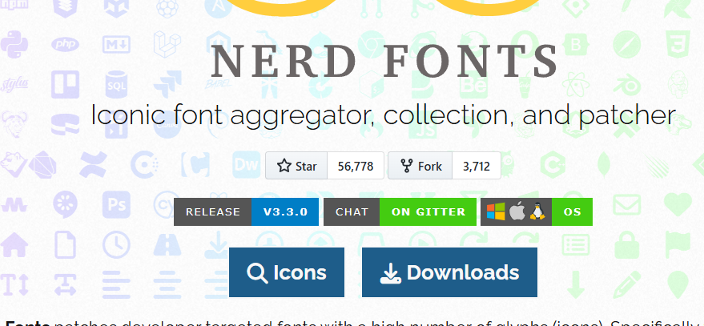

### 5.1. Descargar esta fuente, descomprimir e instalar todo:

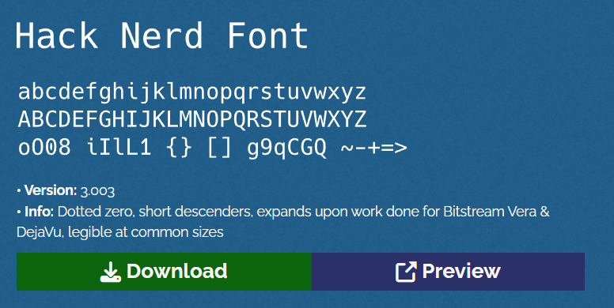


## 6. Establecer "Hack Nerd Font" para el PowerShell como predeterminado

### 6.1. Primero ingresa a SETTINGS de la terminal de POWERSHELL -> Open JSON file (selecciona vscode si está)


### 6.2. Configurar en vscode

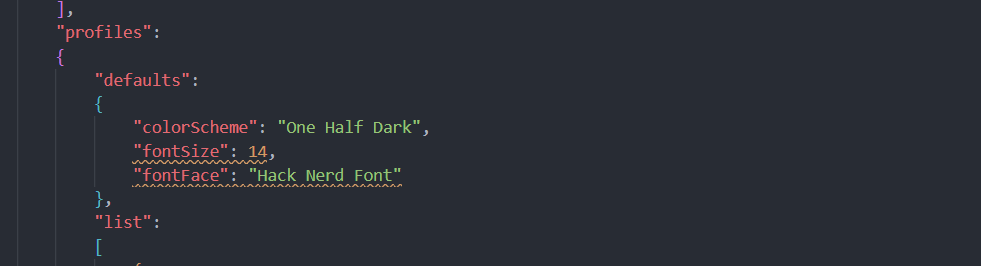

```markdown
        "defaults": 
        {
            "colorScheme": "One Half Dark",
            "fontSize": 14,
            "fontFace": "Hack Nerd Font"
        },
```

## 7. Instalar el Tema en el archivo "$PROFILE"

Ingresar al siguiente link:
https://ohmyposh.dev/docs/installation/prompt

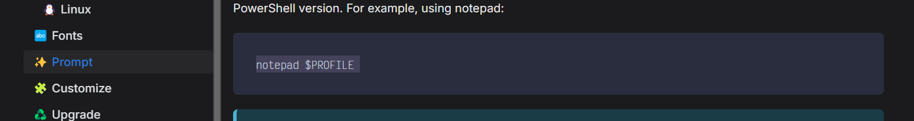

Ahora ejecuta este comando en tu terminal:
```powershell
notepad $PROFILE
```

Tendremos esto y dejarlo ahí, que posteriormente agregaremos algo:
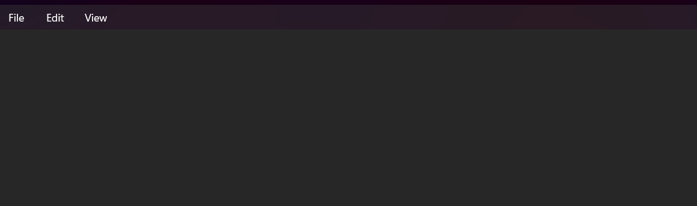


Ingresar al siguiente link:
https://ohmyposh.dev/docs/installation/customize

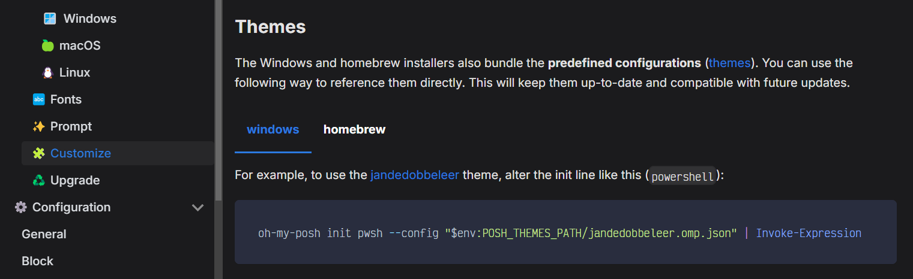

Ahora agregaremos esto al $PERFILE:
```markdown
oh-my-posh init pwsh --config ~/jandedobbeleer.omp.json | Invoke-Expression
```

Tendremos esto y dejarlo ahí, que posteriormente agregaremos algo:
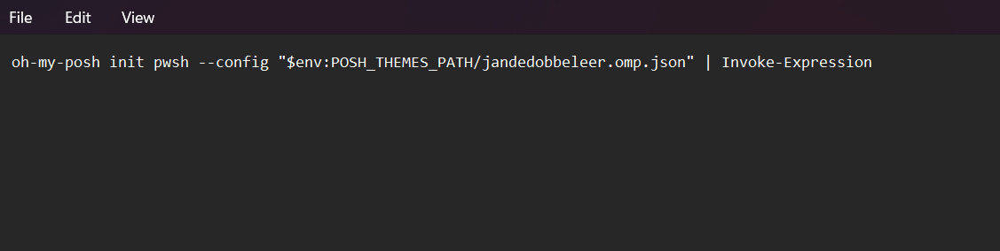


Ahora selecionaremos el tema (simplemente copias el nombre y lo pegas):
jandedobbeleer.omp.json -> agnoster.omp.json
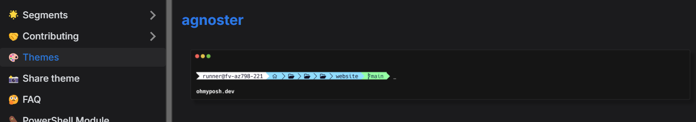

```markdown
oh-my-posh init pwsh --config "$env:POSH_THEMES_PATH/agnoster.omp.json" | Invoke-Expression
```

Pegamos en nuestro $PERFILE:
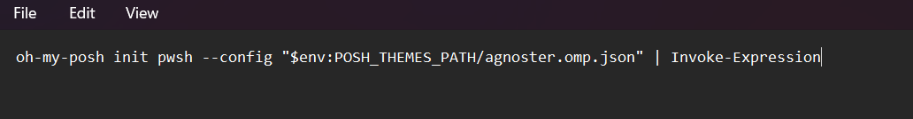


## 8. Instalar los ICONOS (Personalización de archivos)

Ingresar al siguiente link:
https://github.com/devblackops/Terminal-Icons

Instalamos el siguiente modulo:


```powershell
Install-Module -Name Terminal-Icons -Repository PSGallery
```


Instalamos el siguiente modulo:
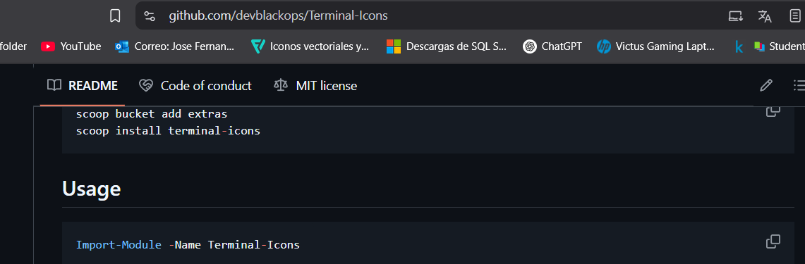

Copiamos lo siguiente y pegamos en $PERFILE:
```markdown
Import-Module -Name Terminal-Icons
```

Pegamos:
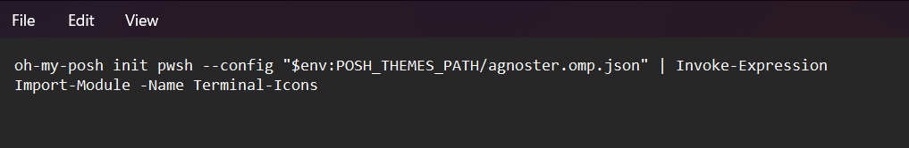


## 9. Configurar en VSCODE

Presionamos CTRL + P

ingresamos a:
```markdown
> Preferences: Open User Settings
```
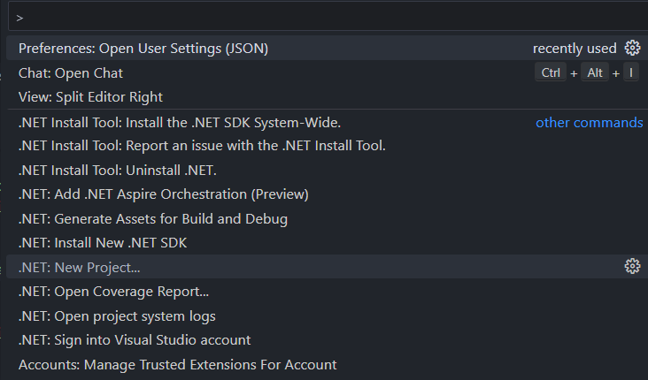

Agregamos la fuente:


```markdown
"terminal.integrated.fontFamily": "Hack Nerd Font"
```
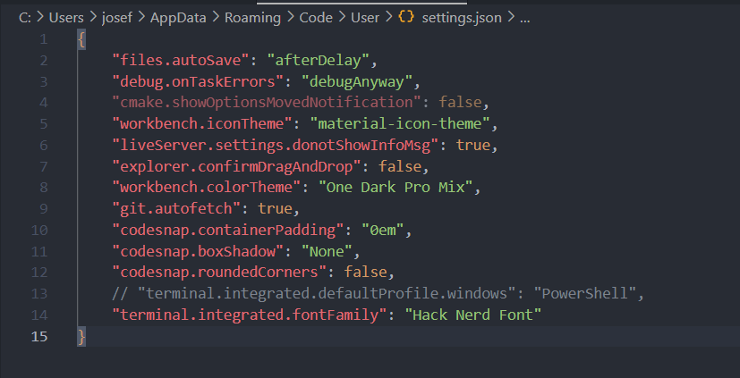


## 10. Autocompletado

Ingresa a tu terminal POWERSHELL y presiona F2 para activar y desactivar la lista de comandos que usaste antes.


