# Configurar TERMINAL - WINDOWS 11
# Guía paso a paso para personalizar PowerShell con temas, íconos y fuente personalizada.

## 1. Descargar "PowerShell" de la Microsoft Store

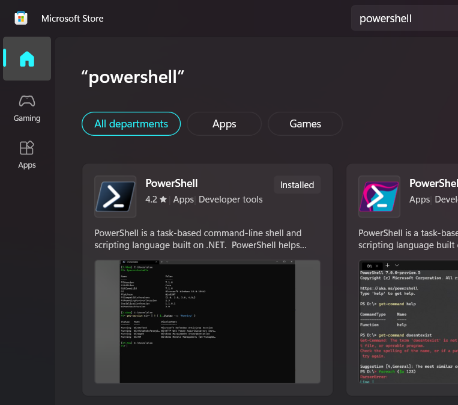


## 2. Establecer "PowerShell" como predeterminado:

### 2.1. Ingresando a Settings
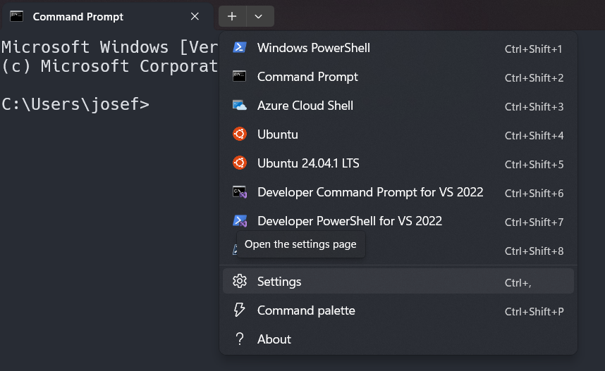


### 2.2. Cambiando terminar por defecto
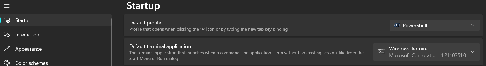

## 3. Instalar "Oh my Posh"

### 3.1. Ingresar al siguiente link:
https://ohmyposh.dev/docs/installation/windows

### 3.2. Copiamos el siguiente codigo:
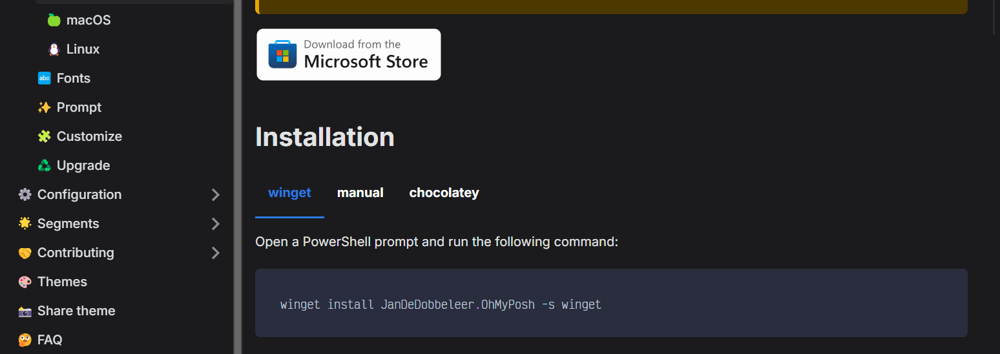

```powershell
winget install JanDeDobbeleer.OhMyPosh -s winget
```

## 4. Crear un perfil

### 4.1. Ingresar al siguiente link:
https://ohmyposh.dev/docs/installation/prompt

### 4.2. Copiamos el siguiente codigo:

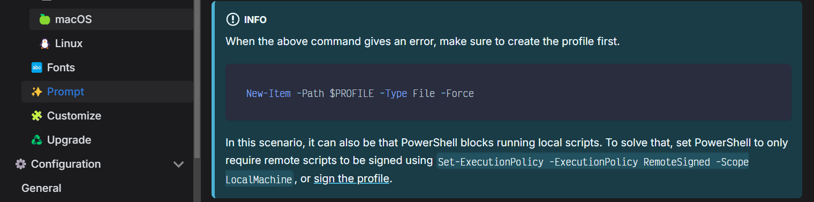

```powershell
New-Item -Path $PROFILE -Type File -Force
```

## 5. Instalar "Hack Nerd Font"

### 5.1. Ingresar al siguiente link:
https://ohmyposh.dev/docs/installation/fonts
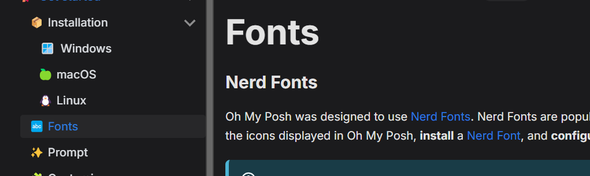
### 5.1. Ingresar al siguiente link:
https://www.nerdfonts.com/
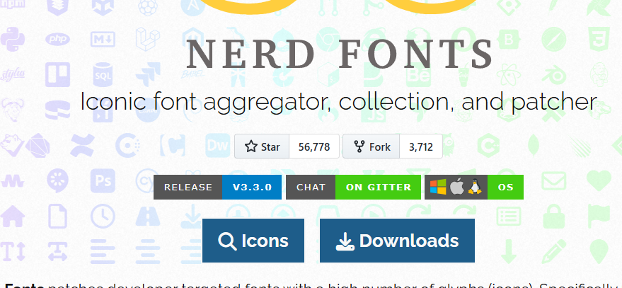
### 5.1. Ingresar al siguiente link (ingresar a este link y busca el font):
https://www.nerdfonts.com/font-downloads

### 5.2. Descargar esta fuente, descomprimir e instalar todo:
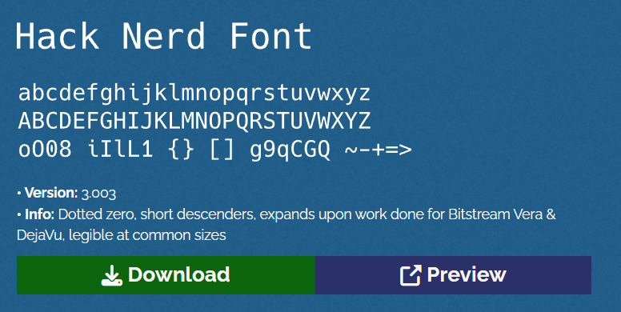


## 6. Establecer "Hack Nerd Font" para el PowerShell como predeterminado

### 6.1. Primero ingresa a SETTINGS de la terminal de POWERSHELL -> Open JSON file (selecciona vscode si está)


### 6.2. Configurar en vscode

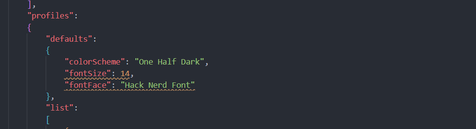

```markdown
        "defaults": 
        {
            "colorScheme": "One Half Dark",
            "fontSize": 14,
            "fontFace": "Hack Nerd Font"
        },
```

## 7. Instalar el Tema en el archivo "$PROFILE"

### 7.1. Ingresar al siguiente link:
https://ohmyposh.dev/docs/installation/prompt

### 7.2. Ahora ejecuta este comando en tu terminal:
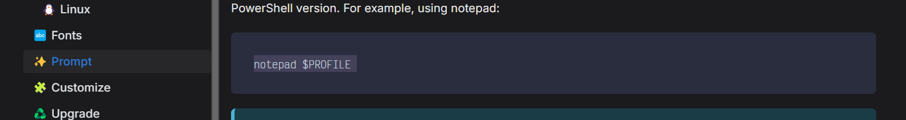

```powershell
notepad $PROFILE
```

### 7.3. Tendremos esto y dejarlo ahí, que posteriormente agregaremos algo:
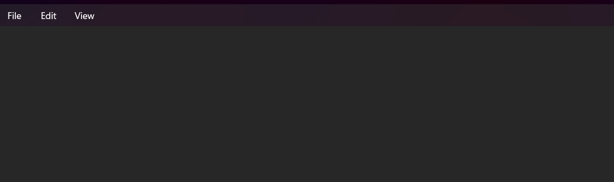


### 7.4. Ingresar al siguiente link:
https://ohmyposh.dev/docs/installation/customize

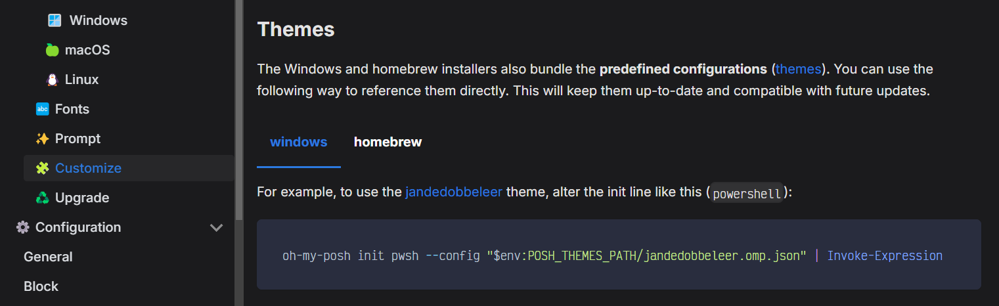

### 7.5. Ingresar al siguiente link:Ahora agregaremos esto al $PERFILE:
```markdown
oh-my-posh init pwsh --config ~/jandedobbeleer.omp.json | Invoke-Expression
```

### 7.6. Tendremos esto y dejarlo ahí, que posteriormente agregaremos algo:
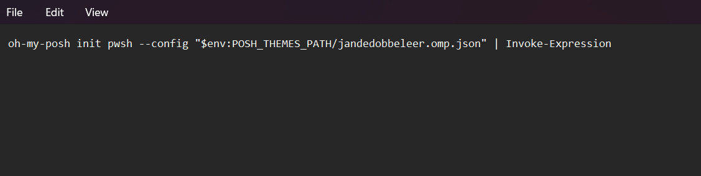


### 7.7. Ahora selecionaremos el tema (simplemente copias el nombre y lo pegas):
jandedobbeleer.omp.json -> agnoster.omp.json
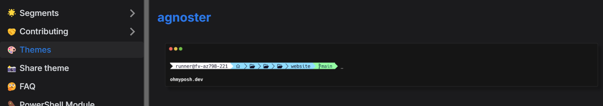

```markdown
oh-my-posh init pwsh --config "$env:POSH_THEMES_PATH/agnoster.omp.json" | Invoke-Expression
```

### 7.8. Pegamos en nuestro $PERFILE:
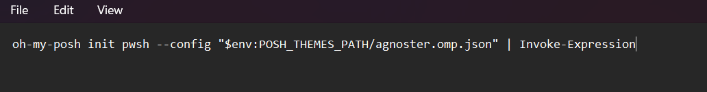


## 8. Instalar los ICONOS (Personalización de archivos)

### 8.1. Ingresar al siguiente link:
https://github.com/devblackops/Terminal-Icons

### 8.2. Instalamos el siguiente modulo:
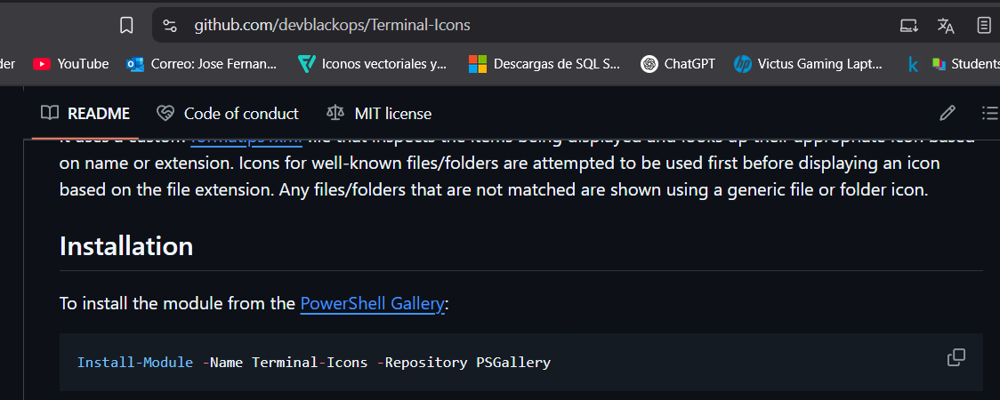

```powershell
Install-Module -Name Terminal-Icons -Repository PSGallery
```


### 8.3. Importamos el siguiente codigo para los iconos:
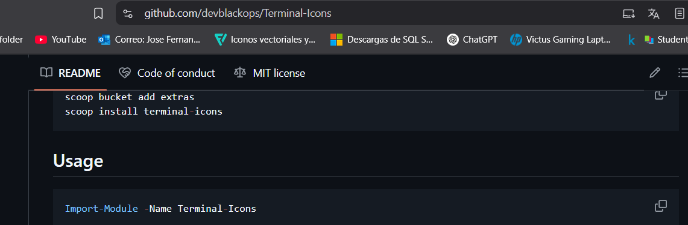

```markdown
Import-Module -Name Terminal-Icons
```

### 8.4. Pegamos en $PERFILE:
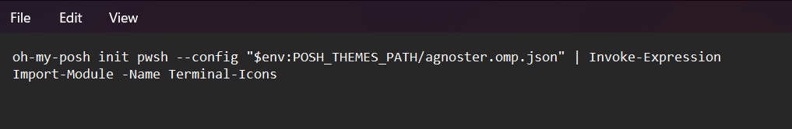


## 9. Configurar en VSCODE

### 9.1. Ingresamos a VSCODE y Presionamos CTRL + P
```markdown
> Preferences: Open User Settings
```
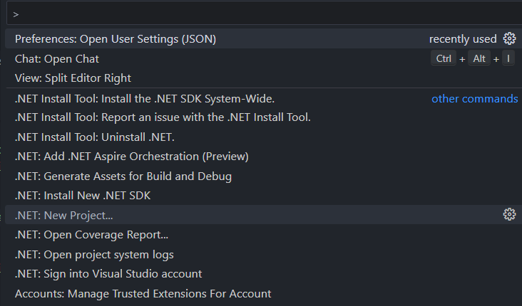

### 9.2. Agregamos la fuente:

```markdown
"terminal.integrated.fontFamily": "Hack Nerd Font"
```
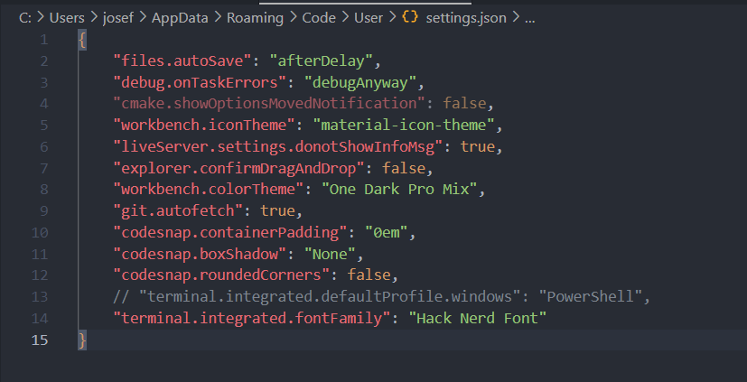


## 10. Autocompletado

Ingrese al tu terminal y presiona F2 para activar o desactivar autocompletado.


